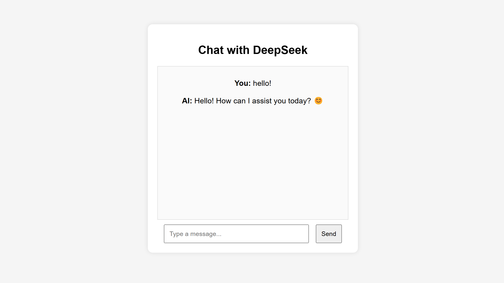

# 📢 AI Chat with Ollama & DeepSeek-R1:7B

A simple Ollama-based `Gemma3` chatbot using **Node.js** and **Express**


*Example chat UI*

## ✨ Features
✅ **Communication with a local LLM through a Web-UI**
✅ **Modern Minimal Dark-mode Design**
✅ **Node.js Backend** with Express.js

---

## 🚀 Getting Started

### 1️⃣ **Install Ollama & Pull the Model**
Ensure you have [Ollama](https://ollama.com/) installed and run the following command to download the `gemma3:4b` (or any other) model:
```sh
ollama pull gemma3:4b
```

### 2️⃣ **Clone the Repository**
```sh
git clone https://github.com/aquastones/ollama-webui.git
cd ollama-webui
```

### 3️⃣ **Install Dependencies**
```sh
npm install
```

### 4️⃣ **Run the Ollama Model**
```sh
ollama run gemma3:4b
```

### 5️⃣ **Start the Server**
```sh
node server.js
```

### 6️⃣ **Open the Chat in Your Browser**
Go to:
```
http://localhost:3000
```

---

## 📜 How It Works
1️⃣ **Frontend (HTML/CSS/JS)**
- Minimal UI with a **chatbox** and input field.
- Sends user messages to the backend.

2️⃣ **Backend (Node.js + Express)**
- Handles chat requests from the frontend.
- Calls Ollama's API to generate responses.

## 🔧 Frameworks Used
- **Node.js** (Backend)
- **Express.js** (Server)
- **Ollama** (AI Model API)
- **JavaScript** (Frontend)
- **HTML + CSS** (UI Design)

---

## 🛠️ Customization
Want to use a different model? Change the `model` name in `server.js`:
```js
const response = await axios.post("http://localhost:11434/api/generate", {
    model: "your-model-name",  // Change model here
    prompt: message,
    stream: false
});
```

---

## 📜 License
This project is open-source under the **MIT License**.

---

## 🌟 Contributing
Got an idea? Found a bug? Feel free to **fork the repo** and submit a **pull request**!

---

## 📬 Contact
- **GitHub**: [aquastones](https://github.com/aquastones)
- **Email**: aquastones@icloud.com